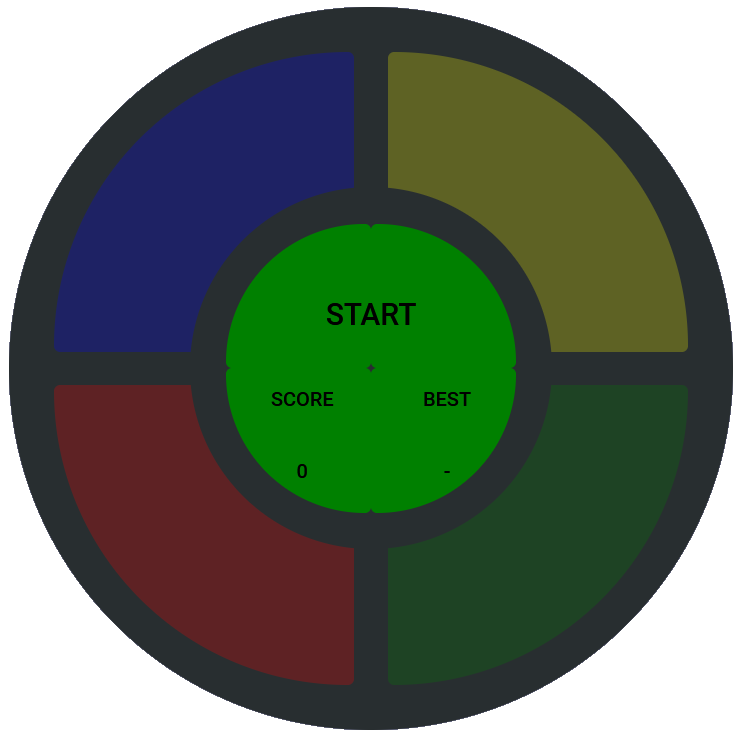

# Projeto - Jogo Gênesis

## Jogo da Memória - Genius

* Nesse projeto, o desafio foi criar um jogo Gênesis utilizando apenas HTML, CSS e Javascript de forma introdutória, sendo o principal conceito, CSS Grid, manipulação de Array e Arrow Functions.
* Professora [Gabriela Pinheiro](https://github.com/SpruceGabriela)
* Bootcamp - [DIO](https://dio.me) - Eduzz

#
## Melhorias Implementadas:

<figure>
    
</figure>

* Inserido circulo central com botão para iniciar o jogo;
* Inserido alteração do botão com instruções para observar e jogar;
* Inserido pontuação atual e melhor pontuação do jogo.
